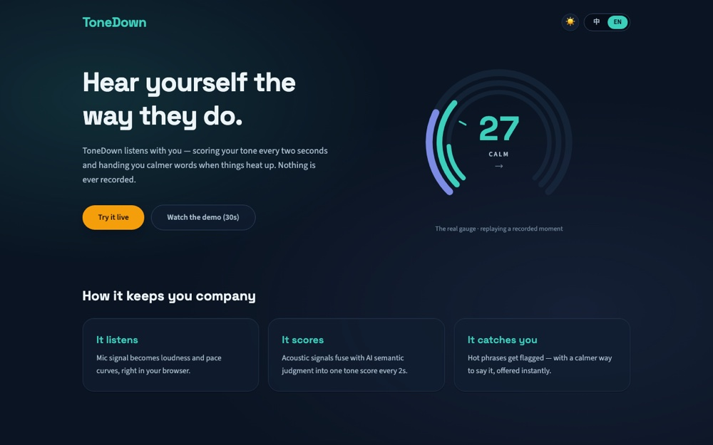

# ToneDown

**Hear yourself the way they do.** ToneDown is a bilingual (EN/中文) live tone coach for heated conversations: it listens with you, fuses acoustic and semantic signals into a tone score every two seconds, flags the sentences that escalate things, hands you calmer rewrites in the moment — and turns the whole session into a debrief you can practice against.

**Live:** https://tone-down.vercel.app · **30-second tour (no mic needed):** https://tone-down.vercel.app/demo

| Surface | What it does |
|---|---|
| `/app` | Live session: three-ring gauge, session ribbon, AI rewrites, 4-7-8 breathing intervention |
| `/demo` | The full loop replayed from a script — zero mic, zero network, zero tokens |
| `/spar` | Six LLM personas to de-escalate; the mood meter is deterministic game state |
| `/gym` | A daily "say it calmer" drill, judged 0–100; streaks and achievements |
| `/history` | Local-only history: calm calendar, trend, JSON export, hold-to-erase |



*Live session — the three-ring gauge, session ribbon, and AI rewrites*

## Architecture

```
┌─────────────────────────── Browser ────────────────────────────┐
│  mic ─ AnalyserNode (100ms RMS) ──► signal bus ─┐               │
│  mic ─ MediaRecorder 4s segments ─► /transcribe ┤               │
│                                                 ▼               │
│   session machine (pure reducer: idle→calibrating→listening    │
│      ⇄escalated→intervention→recap; engines orthogonal)        │
│                  ▲                    │ effects-as-data         │
│   2s fusion ticker (volume+rate+LLM, │ (acquireMic, persist,   │
│   20s freshness decay, rules-exact   ▼  requestDebrief)        │
│   degraded mode)              IndexedDB (Dexie, local-only)    │
└──────────────┬─────────────────────────────────────────────────┘
               │  unified LLM client: budget meter → circuit
               │  breaker → timeout → schema guard → bookkeeping
┌──────────────▼─────────────── Vercel functions ────────────────┐
│  /transcribe /analyze /rewrite /debrief /sparring /gym-grade   │
│  key custody · per-IP rate limits · zod-validated LLM output   │
│  with one corrective retry · content-free logs                 │
└──────────────┬─────────────────────────────────────────────────┘
               ▼
        Groq free tier: whisper-large-v3-turbo · llama-3.3-70b
```

**The fallback chain is the product:** Groq Whisper → Web Speech → volume-only; LLM semantics → keyword rules; every endpoint behind a circuit breaker (3 failures → open, half-open probes, 30s→5min backoff). Fully offline, the entire scoring loop still runs in rules mode. Quota exhaustion is a designed state with honest UI ("AI resting · rules mode"), not an error page.

## Engineering highlights

- **Hand-rolled typed state machine** (~150 lines, no XState): all timing compares against `event.at` from a 1s TICK heartbeat — never `Date.now()` in the reducer — which is exactly what makes the scripted `/demo` and 100+ deterministic transition tests possible. Engine status is orthogonal *context*, not phases. Effects are data the reducer returns; services execute them.
- **Budget engineering against a hard ceiling** (Groq free tier: 100K tokens/day): client-side daily buckets per feature (82K allocated, 18% headroom), conservative estimation charging output at `max_completion_tokens`, adaptive analyze cadence (every segment while heated, coasting when calm), grade caching so identical Gym answers never spend twice, and a zero-token demo mode as the first thing visitors click.
- **Production incident as a design rule — the ESM extension bug:** every deployed API call once died at import time with `ERR_MODULE_NOT_FOUND`; Vercel's Node ESM runtime requires explicit `.js` extensions on relative imports, while the tsx-based dev server happily resolved extensionless ones. The fix wasn't just adding extensions — `tsconfig.api.json` switched to `moduleResolution: nodenext` so **tsc itself now rejects the bug class**, and zod schemas deliberately stay server-only rather than sharing runtime modules across the two resolver worlds. The drift between client guards and server schemas is pinned by type-level `satisfies` plus shared-fixture tests.
- **One call, two jobs in sparring:** `/api/sparring` returns the persona's reply *and* the grade of the user's last message — halving cost — while the win condition lives in deterministic client-side game state (mood meter), so victories can't be sweet-talked out of the model. Streaming was evaluated and rejected with measurements: sub-second full completions, and streamed JSON can't be schema-validated before render.
- **Crimson is a token-level rule:** `--tone-hostile` is the only red in the system, so hostility's color can never be accidentally decorative. The aurora background costs zero JS per frame (transform-only keyframes + `@property` color crossfades, one `dataset` write per band change).
- **Privacy as architecture:** audio is analyzed in flight and discarded; history exists only in IndexedDB (Dexie rides a lazy chunk, never the live path); export is one click, deletion is hold-to-confirm and final; server logs are route/status/duration only.

## Local development

```bash
npm install
cp .env.example .env        # paste your Groq API key (gitignored)
npm run dev:full            # Vite :5173 + local API adapter :3001 (no vercel login needed)
```

`npm run dev` alone runs the client with `/api` failing — a useful drill: the app must keep working in rules mode. `vercel dev` also works once linked. See `TESTING.md` for per-route curls, bilingual manual scripts, and degradation drills.

## Testing & CI

- **Unit (Vitest):** fusion math (including bit-compatibility of the degraded mode with the original rules formula), the full state-machine transition table, budget metering, breaker behavior, and client-guard ↔ server-zod drift fixtures for every LLM schema.
- **E2E (Playwright):** the demo-mode smoke walks suggestion card → breathing morph → recap against the production build, and **any request to `/api` fails the test** — proving zero-network by construction.
- **CI (GitHub Actions):** typecheck, lint, unit tests, build, the e2e smoke, and a full-history gitleaks scan on every push.

## Models & limits

| Route | Model | Params | Limit |
|---|---|---|---|
| /transcribe | whisper-large-v3-turbo | verbose_json, temp 0 | 30/min/IP |
| /analyze | llama-3.3-70b-versatile | temp 0.2 · 150 tok | 30/min/IP |
| /rewrite (+grounding) | llama-3.3-70b-versatile | temp 0.7 · 200/60 tok | 10/min/IP |
| /debrief | llama-3.3-70b-versatile | temp 0.4 · 500 tok | 4/min/IP |
| /sparring | llama-3.3-70b-versatile | temp 0.8 · 220 tok | 12/min/IP |
| /gym-grade | llama-3.3-70b-versatile | temp 0.3 · 160 tok | 6/min/IP |

All JSON-mode with strict validation and one corrective retry at temperature 0; failures degrade to local rules, never to a blank screen. Rate limiting is in-memory per warm instance — documented, deliberate scope for a public demo.

---

*ToneDown is a communication aid, not counseling.*
